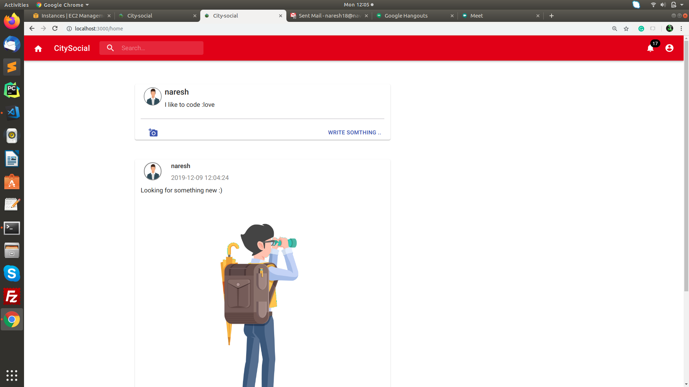

## Live-App
Hey, check out the Live-App, just visit http://3.136.162.92:5000.

## Social-networking-app clone
This is web app like facebook. Here you can createpost (like in fb), you  can comment on post, you can like post,

Firstly you need to login and sorry till the  time there is no feature for forget password 
as I'm working on this project ....... to add more features 

## What are the features in this demo app
1. Createpost (you can upload only pics(type should be jpeg,png,svg,jpg) and vedios(type should be mp4))
2. You can also add post description  and it will see on the top of the post  
2. You can like post ( app will keep recored of liked post by you and show in red color as you have seen in other app)
3. You can comment ( number  of comments you can add and when you will click on total comment button you will see whole comments of that post)
4. User can see his profile 

### How to run the  application 

A. You should also have a AWS account 
1. know login you AWS and create a Bucket under s3
2. And provid a details of bucket inside the .evn file
 note:  you can visit here for help https://docs.aws.amazon.com/AmazonS3/latest/gsg/CreatingABucket.html 

B. setup Node.js and mysql-serevr 
A. TO set up Node.js please refer https://www.digitalocean.com/community/tutorials/how-to-install-node-js-on-ubuntu-16-04
B. to setup mysql please use 
   ``` sudo apt-get update ```
   ``` sudo apt-get install mysql-server ```
   ``` sudo mysql -u root -p ```
   may be it will ask for password enter ranndom password there and then run the following  commannt in the mysql console 
   ``` ALTER USER 'root'@'localhost' IDENTIFIED WITH mysql_native_password BY 'new_password' ```
   and then create database for the app 
  ``` CREATE DATABASE DB_NAME ```

1. clone it on your PC
2. ``` cd social-networking-app/Trackier```
3. ``` npm install ```
4. ``` cd city-share ```
5. ``` npm install ```

Now you app is ready 



### Happy Coding :) 
